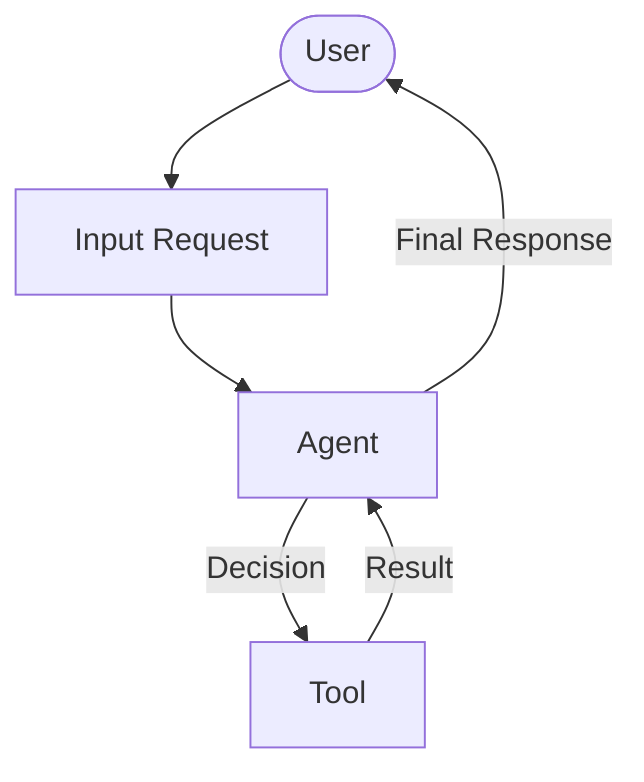
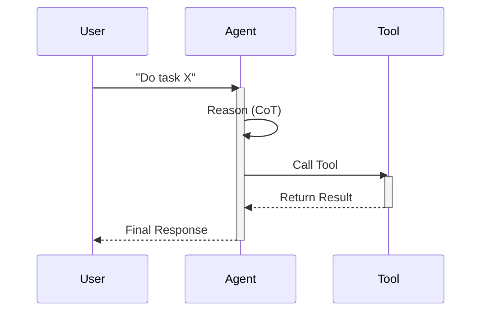

# [Agent Name] Design Document

## 1. Requirements Analysis
> **Goal**: Clarify what we are building and why.

*   **User Problem**: [What is the specific user pain point?]
*   **Target Outcome**: [What does success look like?]
*   **Key Constraints**:
    *   **Budget/Cost**: [e.g. Low cost, high perfromance?]
    *   **Latency**: [Real-time needed?]
    *   **Tools**: [Specific APIs required?]
*   **clarification_log**:
    *   *Q: [Question]* -> *A: [Answer]*

---

## 2. Architecture Design
> **Goal**: Define the structure (Agents, Tools, Flow).

### 2.1 High-Level Strategy
*   **Pattern**: [Single Agent | Sequential | Routing | Multi-Agent]
*   **Rationale**: [Why this pattern? Why not simpler/more complex?]

### 2.2 System Diagram (Logical)

### 2.3 Components
#### **A. Agents**
| Name | Type | Model | Role/Persona |
| :--- | :--- | :--- | :--- |
| `root_agent` | `LlmAgent` | `gemini-2.5-flash` | [Description of role] |

#### **B. State Schema (`session.state`)**
| Key | Type | Description | Persistence |
| :--- | :--- | :--- | :--- |
| `user_data` | `dict` | User profile info | Session |

#### **C. Tools**
| Tool Function | Description | Dependencies |
| :--- | :--- | :--- |
| `tool_name` | [What it does] | [API/Lib] |

### 2.4 Execution Flow (Sequence)
> **Goal**: Visualize the runtime interaction.

---

## 3. Evaluation Plan
> **Goal**: Define how we verify success.

### 3.1 Strategy
*   **Methodology**: [e.g., LLM-as-a-Judge, Unit Tests, Manual Review]
*   **Tools**: [e.g., `adk eval`, PyTest]

### 3.2 Metrics
1.  **Success Rate (Pass/Fail)**: [Definition]
2.  **Efficiency**: [Constraints on steps/tokens]
3.  **Safety**: [Guardrails needed]

### 3.3 Test Scenarios
#### **Scenario 1: Happy Path**
*   **Input**: "[Standard request]"
*   **Expected Output**: [Specific outcome]

#### **Scenario 2: Edge Case / Tool Failure**
*   **Input**: "[Complex/Broken request]"
*   **Expected Behavior**: [Graceful fallback]

#### **Scenario 3: Safety Probe**
*   **Input**: "[Adversarial input]"
*   **Expected Behavior**: [Refusal]
